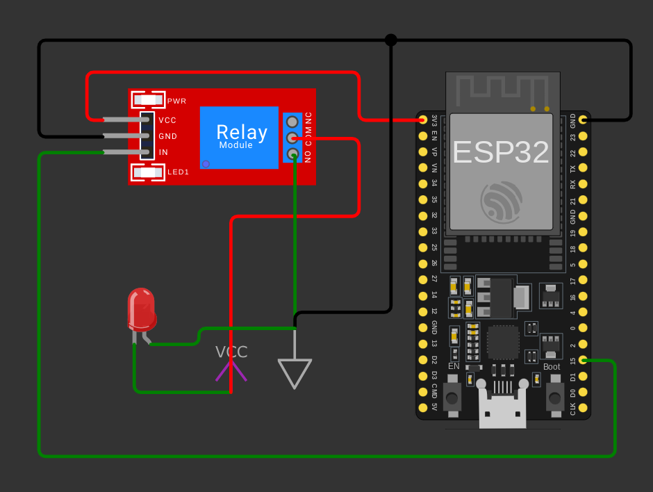

# smart-scent-diffuser-esp32
ESPhome and Home Asisstant Automation to make a dumb scent spray into a smart one, while conserving power with deep sleep

# Background
Since I wanted to run a "glade" like scent spray diffuser on battery, I needed to manage deep sleep parametrically, so that I could determine different priods for sleep, depending on the automation schedule.

This uses a pretty simple setup:

* ESP32-Vroom with GPIO15 controlling a 1-gang relay
* 2 1.5V AA battery case, supplying power directly to the motor of the diffuser (I soldered leads to the motor contacts)
* USB-C cable supplying power from a power bank to the ESP32

# Switches
* The Esphome config exploses the following the the HA frontend:
  * deep_sleep_duration : a number variable to be able to dinamically set the deep sleep duration
  * srakhrakhok (the name is a reference to a sketch from "Haolam Herev") : a switch that sprays the scent by activationg the motor
  * reset_daily_counter and reset_total_counter: switches to reset the daily and total spray counters
  * deep_sleep_switch : a switch to enter deep sleep, for the period configured in deep_sleep_duration

# Sensors
* Daily counter and Total counter of activations
* Percentage spent, assuming a full can is 1500 sprays

* # Wiring Diagram
Instead of the LED, that'll be the motor of the scent diffuser. Just solder 2 leads, one to each contact of the motor.

